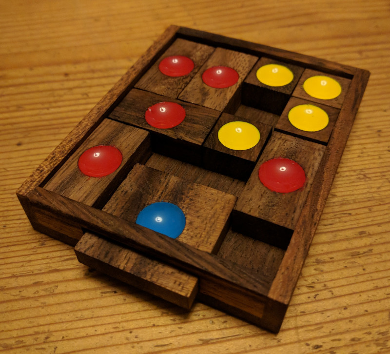

# woopu - wooden puzzle game

This is a digital version of a wooden puzzle game. It is intended to be a programming exercise
to add an "undo"-functionality which the original one lacks.

## how to build

It is a simple Maven project using Java 11
